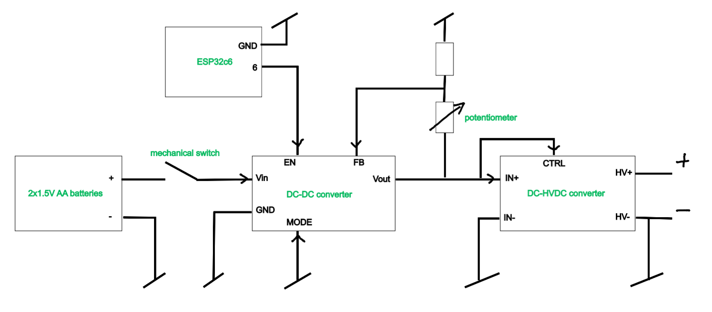
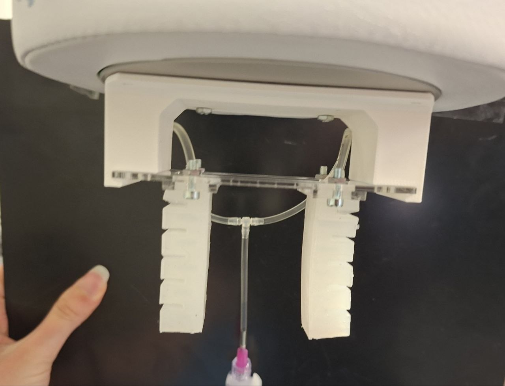
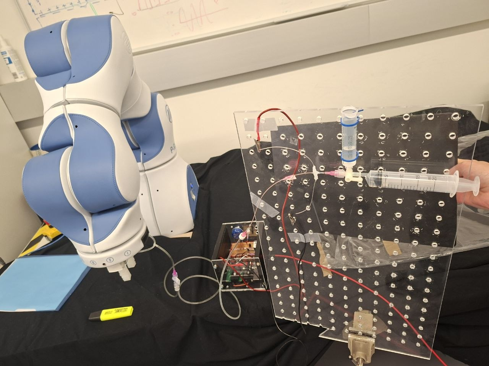

# CAD Gripper — Hardware Repository

## Intro

This repository contains all hardware files for the EHD actuated soft gripper project: CAD source files for laser-cut and 3D-printed parts, along with the electronics design for the control and power system.

---

## Repository Structure

```
cad_files/
├── laser_model_2D/        # 2D drawings (PDF) for laser-cut parts
├── source_laser/          # STEP files for laser-cut parts (2 mm acrylic)
└── source_3d_print/       # STEP files for 3D-printed parts (PLA)
```

---

## Electronics

The electronics are an improved version of the system used in the lab. The key change is that instead of the DC-DC converter being always enabled, its enable pin is now controlled by an ESP32-C6, chosen for its MicroROS compatibility. All components are soldered and mounted on the `elec_holder_main_plate` (laser-cut as part of the electronics box). The ESP is power via USB.

### Block Diagram



### Components

| Qty | Component | Description |
|-----|-----------|-------------|
| 1 | ESP32-C6 dev board | Microcontroller — controls the DC-DC enable pin (https://docs.espressif.com/projects/esp-dev-kits/en/latest/esp32c6/esp32-c6-devkitm-1/user_guide.html)|
| 1 | DC-DC converter | Regulates the battery voltage to supply the HVDC-DC converter (https://www.ti.com/lit/ug/slvuco7/slvuco7.pdf?ts=1695073636848&ref_url=https%253A%252F%252Fwww.ti.com%252Ftool%252FTPSM83100EVM, https://www.ti.com/lit/ds/symlink/tpsm83100.pdf?ts=1695310270090&ref_url=https%253A%252F%252Fwww.ti.com%252Fproduct%252FTPSM83100)|
| 1 | HVDC-DC converter | High-voltage DC-DC — powers the EHD pump; output is linear to input (https://www.xppower.com/storage/portals/0/pdfs/SF_A_Series.pdf)|
| 1 | Potentiometer | Analog input for output voltage control |
| 1 | Mechanical switch | Safety switch — cuts the circuit |
| 2 | Proto board | Mounting support for the ESP32 and HVDC-DC converter |
| 2 | AA batteries | Main power source |
| 1 | Battery holder | |

---

## Assembly

### Parts List

**Laser-cut (2 mm acrylic):**
- `elec_holder_back_part1` / `elec_holder_back_part2` — Electronics enclosure back panels
- `elec_holder_front` — Electronics enclosure front panel
- `elec_holder_main_plate` — Main mounting plate
- `elec_holder_gripper_attachment` — Gripper-side attachment (top)
- `elec_holder_robot_attachment` — Robot arm-side attachment (bottom)
- `elec_holder_spacer_robot` — Spacer for robot attachment
- `gripper_attachment_silicone` — Silicone gripper attachment interface
- `gripper_direct_attachement_laser` — Direct gripper attachment (laser variant)

**3D-printed (PLA):**
- `elec_holder_bananaPlugs_holder` — Banana plug holder
- `elec_holder_wall_left` / `wall_right` — Side walls for electronics enclosure
- `elec_holder_devBoard_DCDC_holder` — DC-DC dev board mount
- `gripper_direct_attachement_3d` — Direct gripper attachment (3D variant)

---

### Electronics Box Assembly

> The box was originally designed to also house a pump and a liquid pouch. This was later abandoned to improve safety (separating electronics from liquid) and reduce the weight on the robot. Some holes on the top and bottom panels remain from that initial design. As a result, `elec_box part1` only needs to be laser-cut when the box is not used as a gripper support in direct contact with the robot and `elec_box part2` file contains the attachemnt for the robot ant the gripper.

**Components:**
- 1× `elec_holder_wall_right` (3D-printed)
- 1× `elec_holder_wall_left` (3D-printed)
- 1× `elec_holder_devBoard_DCDC_holder` (3D-printed)
- 1× `elec_holder_bananaPlugs_holder` (3D-printed)
- 1× `elec_holder_back_part1` (laser-cut)
- All electronic components
- 12× heat inserts (https://www.bossard.com/ch-en/eshop/threaded-inserts-for-press-in-for-plastic-materials/tappex-multisert-003-004/p/37896/?autoScroll=true&articleNumber=3794534)

**Assembly steps:**
1. Install the heat inserts
2. Attach the electronics to their respective layers
3. Attach the bottom and both back panels to the walls
4. Slide the layers in, routing the switch and potentiometer to the back panel
5. Close the box with the front panel and screws

> Refer to the assembly video below — note that not all components are rendered.

https://github.com/user-attachments/assets/7390a7a7-a0ae-449d-9c6a-b7f72b6546bb

---

### Gripper Assembly

**Components:**
- 1× `gripper_direct_attachement_3d` (3D-printed)
- 2× silicone modules
- 1× `gripper_attachment_silicone` (laser-cut, 2 mm acrylic)
- 2× heat inserts (https://www.bossard.com/ch-en/eshop/threaded-inserts-for-press-in-for-plastic-materials/tappex-multisert-003-004/p/37896/?autoScroll=true&articleNumber=3794534)
- Tubing

**Assembly steps:**
1. Connect tubes to the silicone gripper modules
2. Glue the modules onto the small attachment pieces
3. Screw the small attachments into the attachment plate — the modular design allows spacing adjustment and module swapping
4. Install heat inserts in the 3D-printed part
5. Screw the 3D-printed part onto the robot
6. Slide the attachment plate into the 3D-printed part and screw in place if needed




### Full Assembly

Once every part is tested and validated, the pump can be connected:

1. Mount a liquid reservoir at an elevated position
2. Attach the pump between the reservoir and the gripper tube
3. Fill the system with liquid
4. Connect the pump to the banana plug connectors


